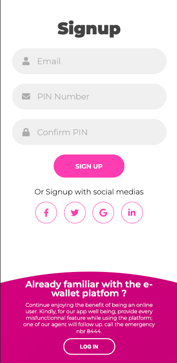

# E-wallet

> In line with the cashless economy in Rwanda, XYZ company based in Kigali wants to bring an
e-wallet system to the local citizens. XYZ would like to design and implement this solution
as a software developer with the preferred technologies.

### Desktop version view

### Mobile version view

## Built With

- HTML
- CSS
- Linters
- Javascript
- VS code

## Live Demo

For the link to the live demo, [Click here]()

Prerequisites

You only need a browser to run the html file.

## 👤 Author

- GitHub: [@githubhandle](https://github.com/keza681)
- LinkedIn: [LinkedIn](https://www.linkedin.com/in/linda-keza/)

## 🤝 Contributing

Contributions, issues, and feature requests are welcome!

Feel free to check the [issues page](https://github.com/keza681/E-wallet/issues/new).

## Show your support

Give a ⭐️ if you like this project!

## Acknowledgments

- Hat tip to anyone whose code was used
- Inspiration
- etc

## 📝 License

This project is [MIT](./LICENSE) licensed.